# WP_UPDATES.md — WordPress updates for versioning

What the TCIA WordPress site (Collection Manager / Pods) needs so that Posda's
dataset and recordset versioning can drive it. Started 2026-09-24.
**Discussion notes, no decision made yet.**

Sources: the **Pods export** (Pods 2.9.19.5, taken 2026-09-24), live REST
responses from `https://www.cancerimagingarchive.net/api/v1/…`, and
`oneposda/.../papi/util/wp.py`.

## Contents

1. [The two needs](#1-the-two-needs)
2. [Posda's release model](#2-posdas-release-model)
3. [WordPress today](#3-wordpress-today)
4. [Why today's setup can't meet the needs](#4-why-todays-setup-cant-meet-the-needs)
5. [Need A — draft the next version](#5-need-a--draft-the-next-version-without-touching-the-live-one)
6. [Need B — version the downloads](#6-need-b--version-the-downloads-recordsets)
7. [Putting them together](#7-putting-them-together)
8. [Worked example](#8-worked-example-a3--b3)
9. [Open questions](#9-open-questions)
10. [Side notes on `wp.py`](#10-side-notes-on-oneposda-wppy)

---

## 1. The two needs

- **A — Draft the next version without touching the live one.** Curators need
  to prepare version N+1 of a collection in WordPress (text, downloads, counts)
  while version N stays public and unchanged. Then it all goes live at once.
- **B — Version the downloads (recordsets).** In Posda each recordset (Imaging,
  Clinical, …) has its own releases. WordPress versions only the collection
  page, so a download has no version, no history, and no way to be carried
  forward unchanged into the next collection version.

## 2. Posda's release model

The shape everything below is measured against. Four tables, two kinds of link:

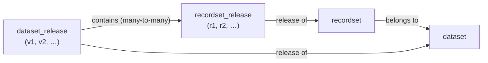

- **Ownership:** a recordset belongs to one dataset (`recordset.dataset_id`).
- **Release of:** each release points at the thing it's a release of
  (`dataset_release.dataset_id`, `recordset_release.recordset_id`).
- **Composition:** a dataset release contains specific recordset releases
  (`dataset_release_recordset`). An unchanged recordset is *carried forward*:
  the same recordset release sits in both v1 and v2.

The dataset never points at a recordset *release*, and a dataset release never
points at a *general* recordset. You get from one to the other by going around
the square.

## 3. WordPress today

Every pod is a `post_type` with `storage: meta`, REST namespace `v1`. Media is
core WP. **⇄** marks a two-way ("sister") Pods relationship: writing one side
updates the other.

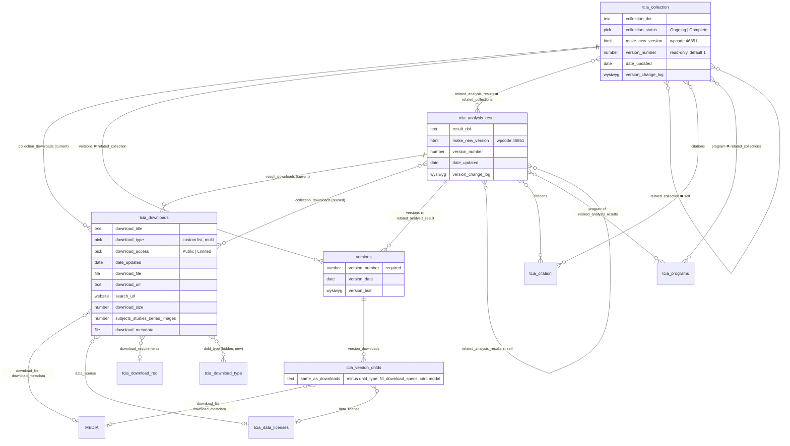

**Descriptive lookups aren't drawn above.** They are all post-type picks,
returned over REST as **names**, not IDs: `tcia_cancer_type`,
`tcia_cancer_location`, `tcia_species`, `tcia_data_type`, `tcia_file_type`,
`tcia_supporting_data`. Other extras: the `tcia_headings` taxonomy and the
`tcia_collections_settings` settings page.

### How versioning works today

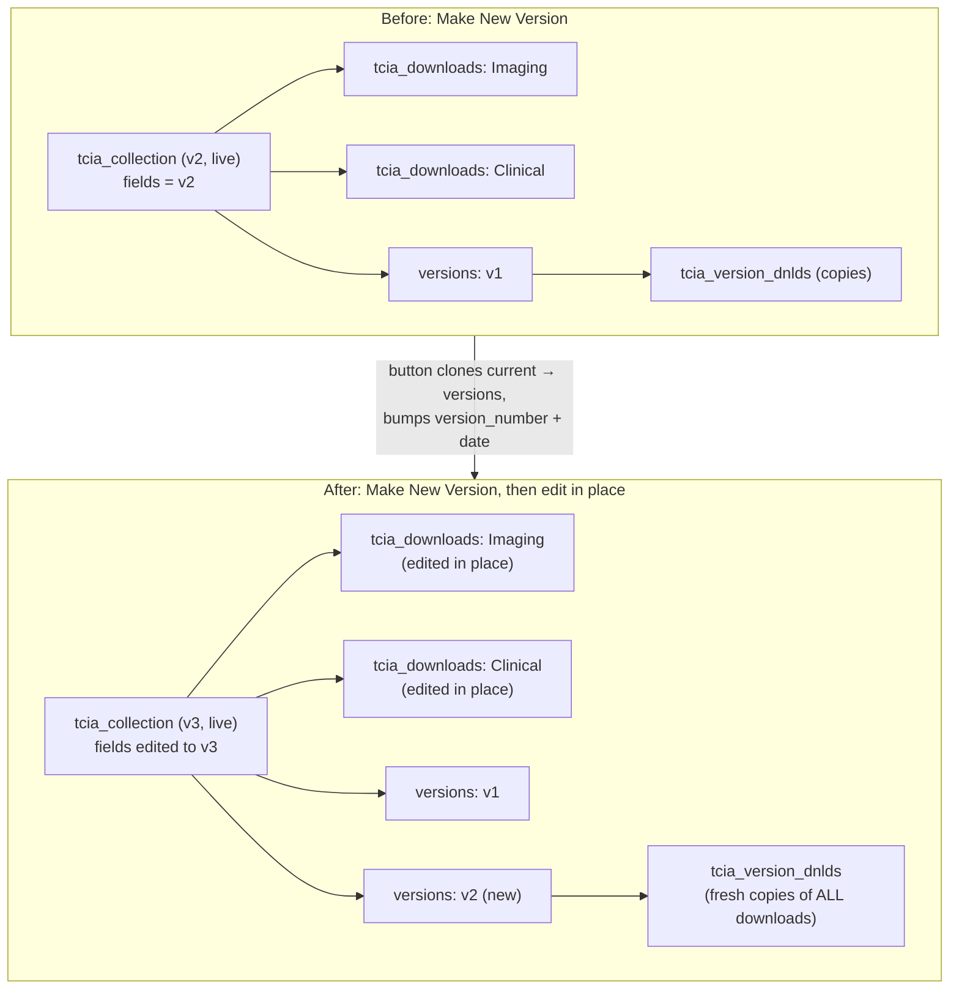

- **The collection post *is* the current version.** It holds `version_number`
  (a plain integer), `date_updated` and `version_change_log`. Its current
  downloads hang off `collection_downloads` / `result_downloads`.
- **Make New Version is a button** (WPCode snippet 46851). It clones the current
  state into a `versions` post plus copies of every download
  (`tcia_version_dnlds`), then bumps the number and date. Curators then edit the
  live post in place.
- **A previous version is a copy.** `tcia_version_dnlds` is a separate post type
  with nearly the same fields as `tcia_downloads`, so every archive duplicates
  every download under new IDs, changed or not.
- **Downloads have no back-link and no version.** The page → download pick only
  goes one way, so a download doesn't know which page it's on. One download can
  also appear on several pages: an analysis result lists other collections'
  downloads in `collection_downloads`.

### Posda ↔ WordPress mapping today

| Posda | WordPress | Linked via |
|---|---|---|
| `dataset` | `tcia_collection` / `tcia_analysis_result` | `wp_object_map` |
| `recordset` | `tcia_downloads` | `wp_object_map` |
| `file` | media attachment | `wp_object_map` (avoids uploading the same file twice) |
| `dataset_release` | — *(deferred)* | — |
| `recordset_release` | — *(deferred)* | — |

## 4. Why today's setup can't meet the needs

A WordPress post has **one** set of field values. A published post shows its
fields as they are right now, and saving changes to it is instantly public.

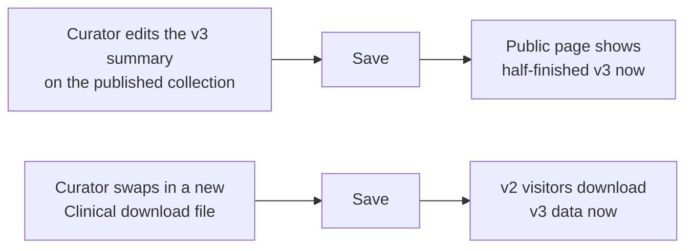

- **Need A fails** because there's nowhere to keep v3 while v2 stays live.
  "Make New Version" only archives the old state. The new state is still built
  by editing the live post.
- **Need B fails** because a download is edited in place, has no release number,
  and each dataset version gets its own full copy instead of reusing unchanged
  releases.

---

## 5. Need A — draft the next version without touching the live one

### A1 — Keep the draft in Posda (no WordPress changes)

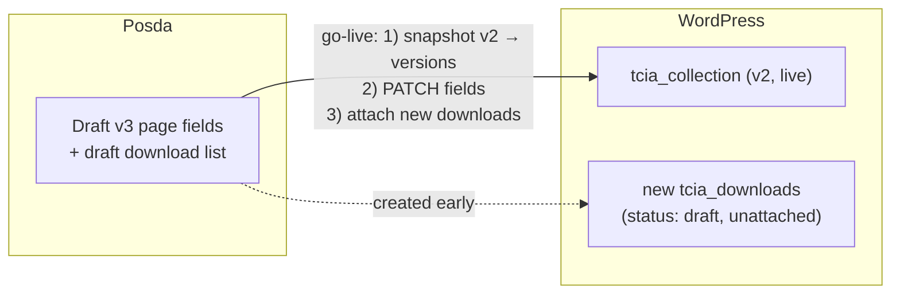

- **What changes in WordPress:** nothing.
- **How it works:** Posda holds the next version's page fields and download
  list. New download posts are created as drafts and left unattached. At
  go-live, Posda does over REST what the button does today (create the
  `versions` post and `tcia_version_dnlds` copies), then PATCHes the live
  collection and attaches the new downloads.
- **Pros:** zero WordPress work. Posda is in full control of timing.
- **Cons:** curators can't edit or preview the next version in WordPress.
  Posda would need editors for fields WordPress already has (summary, methods,
  acknowledgements…). Go-live is several separate writes, so a failure partway
  leaves a mix of old and new.

### A2 — Shadow draft post, "rewrite and republish" (small WordPress change)

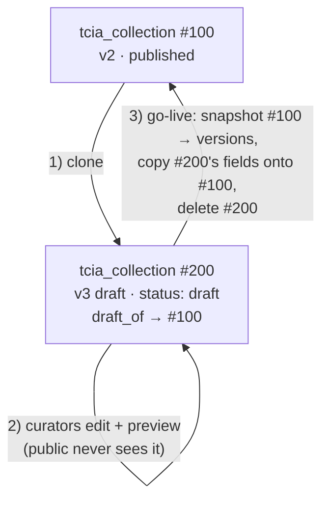

- **What changes in WordPress:** add a `draft_of` pick (collection → collection,
  and the same on `tcia_analysis_result`). Downloads that change get the same
  treatment, so also add `draft_of` on `tcia_downloads`.
- **How it works:** clone the live post into a draft copy. Curators edit and
  preview the copy like any WordPress post. At go-live the live post is
  snapshotted into `versions` (what the button does today), the copy's fields
  are written onto the live post, and the copy is deleted. The live post keeps
  its ID, slug, URL and DOI landing page. The Yoast Duplicate Post plugin
  ("Rewrite & Republish") does this if it's installed or can be. Posda could
  also do it over REST.
- **⚠ Two-way relationships.** If the clone sets `program`,
  `related_analysis_results` or `related_collection`, Pods also adds the clone
  to the *other* side's list, so a draft would show up on the Program page and
  on related collections. The clone must leave those fields empty, and go-live
  keeps the live post's values.

  ```mermaid
  flowchart LR
      CL["Draft clone #200"] -- "program = CPTAC" --> PR["tcia_programs: CPTAC"]
      PR -- "sister auto-adds #200 to<br/>related_collections" --> CL
      PR --> X["CPTAC program page now<br/>lists a draft ✗"]
  ```
- **Pros:** real drafting and preview in WordPress, the existing templates
  keep working, and the snapshot logic already exists.
- **Cons:** it's still copy-based (snapshots duplicate downloads). The
  two-way-relationship rule has to be enforced by whatever makes the clone.
  Merging the copy back is a field-by-field write.

### A3 — Versions become real pages (restructure)

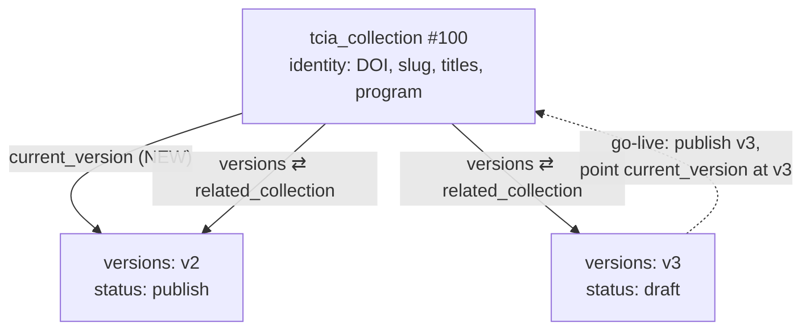

- **What changes in WordPress:**
  - `tcia_collection` / `tcia_analysis_result` keep only **identity** fields:
    DOI, slug, titles, featured image, program, related pages, and possibly
    citations.
  - Fields that change per version **move to `versions`**: downloads, version
    number, date, change log, subject count, and whichever text fields should be
    versioned (see [open question 3](#9-open-questions)).
  - New `current_version` pick on the collection → `versions` (single).
  - **The page templates change** to render from `current_version` instead of
    the collection's own fields.
- **How it works:** the next version is simply a new `versions` post in draft.
  Curators edit and preview it. Go-live publishes it and moves one pointer.
  Rolling back means moving the pointer back. Nothing is copied.
- **Pros:** drafting is native. Go-live is one atomic switch. Previous versions
  can show their full page, not just their downloads. It matches Posda's
  `dataset` / `dataset_release` exactly.
- **Cons:** templates must be rewritten (they aren't in the Pods export).
  Existing data needs migrating (the [migration sketch](#migration-sketch-a3--b3)
  is below). This is the biggest change.

---

## 6. Need B — version the downloads (recordsets)

### B1 — Posda owns recordset versions (no WordPress changes)

- **Mapping:** `recordset` → the live `tcia_downloads` post.
  `recordset_release` → the `tcia_version_dnlds` copy made when that release was
  archived.
- **How it works:** the same as today. The live download is edited in place,
  and the snapshot copies it into `tcia_version_dnlds`. Posda knows which
  release each post represents and WordPress doesn't.
- **Pros:** nothing to build in WordPress.
- **Cons:** every dataset version copies *every* download, changed or not.
  WordPress never shows a recordset's own version, and the live download is
  still edited in place (so it needs A1 or A2 to draft safely).

### B2 — Label the downloads (small WordPress change)

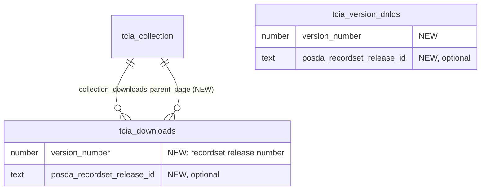

- **What changes in WordPress:** on both download pods, add a `version_number`
  (the recordset's own release number) and a `parent_page` pick (the missing
  back-link). Optionally add the Posda recordset release ID for matching.
- **How it works:** B1's behavior, but the page can show "Imaging r1 ·
  Clinical r3", and every download knows its page.
- **Pros:** small and additive, with no template rewrite needed (the label is
  optional to display).
- **Cons:** still copy-based. An unchanged recordset gets a fresh copy with
  every dataset version.

### B3 — Split downloads into identity + release (restructure)

The same split as A3, applied to downloads:

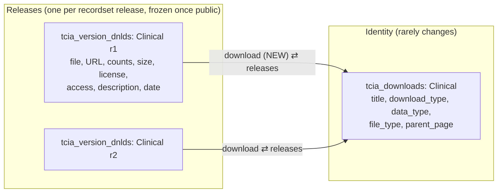

- **What changes in WordPress:**
  - `tcia_downloads` keeps only **identity**: title/slug, `download_type`,
    `data_type` / `file_type`, `parent_page` (NEW), and optionally the Posda
    recordset ID.
  - `tcia_version_dnlds` becomes **the release**: it keeps all its current
    content fields and gains a `download` pick back to its identity post plus a
    `version_number` (the recordset's own release number).
  - `versions.version_downloads` **already points at `tcia_version_dnlds`**, so
    that link doesn't change.
- **How it works:** a new recordset release is a new draft
  `tcia_version_dnlds` post. It's attached to the draft `versions` post and
  published at go-live. A recordset carried forward unchanged is just listed
  again: the same release post sits in both v1's and v2's `version_downloads`.
  A release is never edited after it's public.
- **Don't add a "current release" pointer on `tcia_downloads`.** The collection's
  current version already says which release of each recordset is live. A
  second pointer is a second source of truth that can disagree.
- **Analysis results that reuse a collection's download** should point at a
  specific `tcia_version_dnlds` (the release the analysis actually used), not
  the identity post, which would silently follow the latest release.
- **Pros:** no duplication, drafts come free, and "Clinical: r1 → r2 → r3"
  history is possible. It matches Posda's `recordset` / `recordset_release`
  exactly. It builds on the existing previous-versions data instead of
  replacing it.
- **Cons:** needs A3 to be tidy (without a `current_version` pointer, the page
  has to list release posts directly). Needs migration and template changes.

---

## 7. Putting them together

The A and B options pair naturally:

| | **A1 + B1** "Posda does it" | **A2 + B2** "minimal WordPress change" | **A3 + B3** "WordPress mirrors Posda" |
|---|---|---|---|
| WordPress schema changes | none | `draft_of` on 3 pods; `version_number` + `parent_page` on 2 download pods | collection/download pods slimmed to identity; `current_version`, `download`, `version_number` added |
| Template changes | none | none | collection, analysis-result and download templates |
| Data migration | none | none (new fields start empty) | yes (sketch below) |
| Draft editing & preview in WordPress | ✗ (Posda UI) | ✓ | ✓ (native) |
| Go-live | several writes by Posda | merge draft copy into the live post | publish + move one pointer |
| Rollback | manual | manual | move the pointer back |
| Unchanged downloads copied per version | yes | yes | no, reused |
| Recordset version visible on the site | no | yes (label) | yes (real history) |
| Two-way-relationship risk | low | **must be managed** | low |
| Fit with Posda's model | loose | close | exact |

**Recommendation:**
- **A2 + B2** if the goal is the smallest change that meets both needs. It gives
  real drafts in WordPress, keeps every template, and needs no data migration.
- **A3 + B3** is the correct end state. WordPress and Posda would have the same
  structure, there are no copies to keep in sync, and go-live and rollback are a
  single switch.
- A2 + B2 → A3 + B3 is a reasonable path too. B2's `parent_page` and
  `version_number` fields carry straight over into B3.

### How Posda maps under each

| Posda | A1 + B1 | A2 + B2 | A3 + B3 |
|---|---|---|---|
| `dataset` | `tcia_collection` | `tcia_collection` | `tcia_collection` (identity) |
| `dataset_release` | `versions` (on archive) | `versions` (on archive) | `versions` (**draft → current**) |
| `recordset` | `tcia_downloads` | `tcia_downloads` | `tcia_downloads` (identity) |
| `recordset_release` | `tcia_version_dnlds` (on archive) | `tcia_version_dnlds` (on archive) | `tcia_version_dnlds` (**the release**) |

### Go-live under A3 + B3

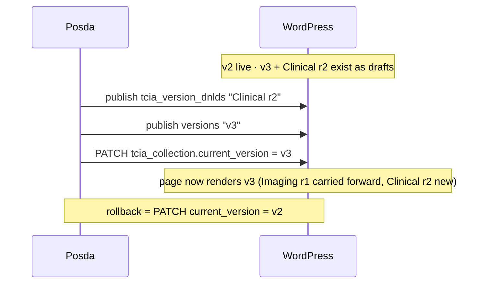

### Migration sketch (A3 + B3)

1. **Collections:** for each collection / analysis result, create a
   `versions` post from its current fields (version number, date, change log,
   downloads, and any other fields that move) and set `current_version` to it.
2. **Downloads:** for each `tcia_downloads` post, create a
   `tcia_version_dnlds` release holding its current content, point the release's
   `download` back at it, then strip it down to identity fields. Put the new
   release in the new current `versions` post from step 1.
3. **Existing previous versions:** their `version_downloads` already point at
   `tcia_version_dnlds`, so they keep working. They were copies with no
   back-link, so linking them to an identity post means matching by title and
   collection. Leaving old ones unlinked is an acceptable fallback, since the
   link can be optional.
4. **Analysis results:** repoint `collection_downloads` at the specific
   `tcia_version_dnlds` releases they used.
5. **Templates:** switch collection, analysis-result and download rendering to
   read through `current_version`.

---

## 8. Worked example (A3 + B3)

TCGA-XYZ has two recordsets, Imaging and Clinical. v2 changes only Clinical.

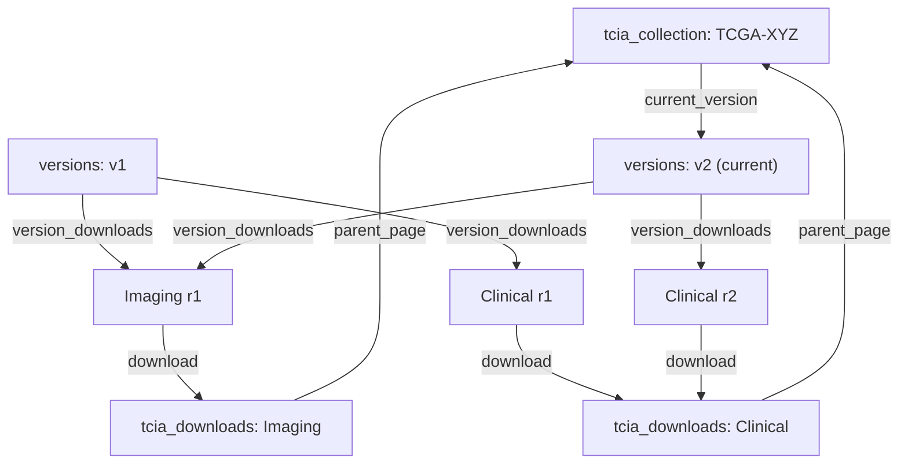

| Post | Links to |
|---|---|
| `tcia_downloads` "Imaging" | `parent_page` → TCGA-XYZ |
| `tcia_downloads` "Clinical" | `parent_page` → TCGA-XYZ |
| `tcia_version_dnlds` "Imaging r1" | `download` → Imaging |
| `tcia_version_dnlds` "Clinical r1" | `download` → Clinical |
| `tcia_version_dnlds` "Clinical r2" | `download` → Clinical |
| `versions` "v1" | `version_downloads` → Imaging r1, Clinical r1 |
| `versions` "v2" | `version_downloads` → Imaging r1, **Clinical r2** |

**Which link answers which question:**
- *What does the public page show?* collection → `current_version` →
  `version_downloads`. This is the only path the page needs.
- *What recordsets does this collection have?* `tcia_downloads` whose
  `parent_page` is the collection.
- *What's the history of Clinical?* releases whose `download` is Clinical:
  r1, r2.

The collection → general recordset link only says "these belong to me". Which
release is live always goes through the version.

---

## 9. Open questions

1. **Are Yoast Duplicate Post or PublishPress Revisions installed, or
   allowed?** Either would do most of A2's clone / merge.
2. **Do the templates show a download that's attached but still in draft
   status?** The download picks accept any status. If drafts are hidden,
   attaching new downloads early is safe, which helps A1 and A2.
3. **Which collection fields are per-version?** For example: should a previous
   version show its own summary, methods and subject count, or only its
   downloads and change log? This decides how much moves in A3.
4. **Who can change the Pods templates** (Collection Template A, Analysis
   Result Template A, list templates)? They're the main cost of A3 + B3, and
   they aren't in the Pods export.
5. **DOIs:** does a version (or a recordset release) ever get its own DOI? If
   so, it belongs on `versions` / `tcia_version_dnlds`.

## 10. Side notes on `oneposda` `wp.py`

- **`dcid_type` — to explore.** `format_download` reads it and has done so since
  `wp.py` was created (commit `59e06257`, 2026-05-21). No pod defines it, none
  of 100 live download records has the key, and nothing reads it. The nearest
  real field is `dnld_type` (the hidden "Download Type (new)" pick →
  `tcia_download_type`), which is `false` on all 100 sampled records. Probably
  a typo or leftover of `dnld_type`.
- `versions.related_collection` / `related_analysis_result` come back as a
  **name**, not an ID. Resolve a version's parent through the parent's
  `versions` list instead.
- Known and fine: download `cancer_type` / `cancer_location` / `species` are
  not readable over REST (always null). Version downloads lack
  `fill_download_specs` and `display_cdrc_modal_dialog`, so those keys come back
  empty.
